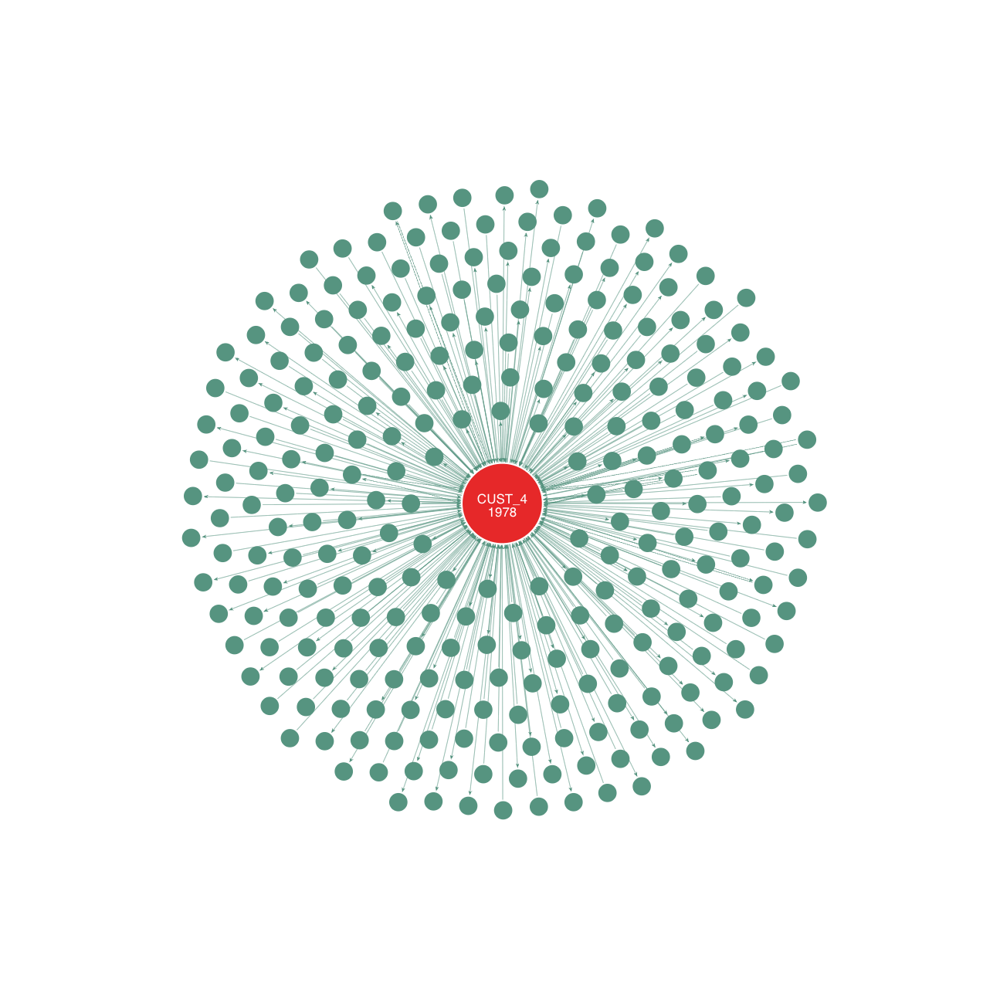
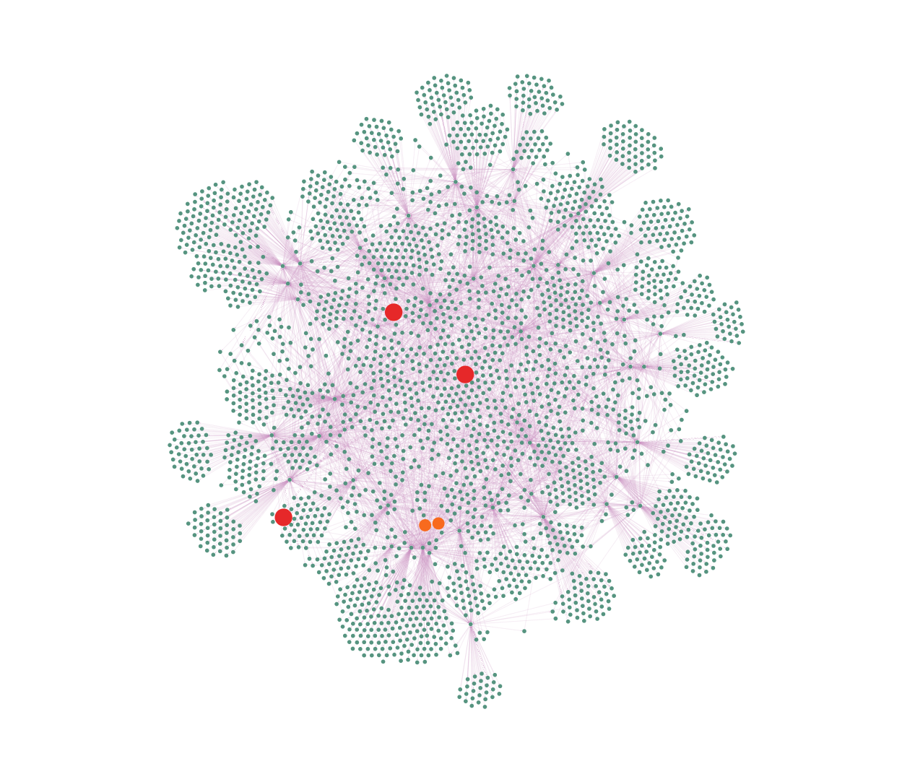
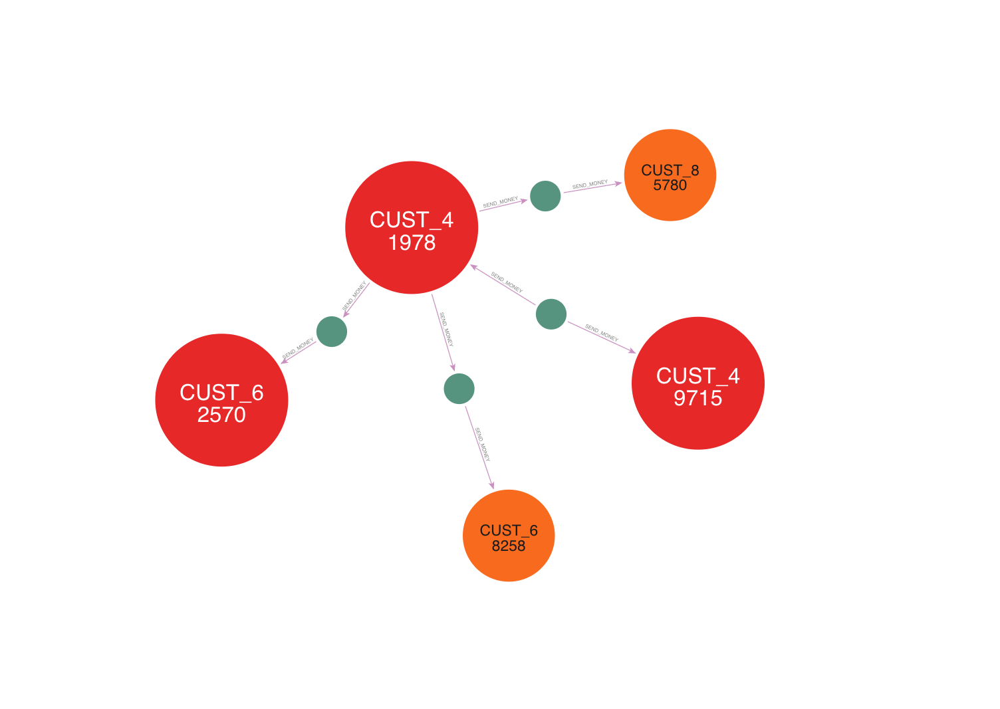

# Data Models and Databases Project II. Report

Mate Balogh\
E28H7B

[Github repository](https://github.com/matthew-balogh/data-models-databases-projects.git)

## 0. Contextual Change

In my first assignment, I introduced the scenario of a simple fraudulent transaction detection mechanism that is triggered on new card transactions, which was based on historical statistics of the related customer to decide whether to approve or decline the transaction.

For this assignment, I kept the same transactional records yet modified the scenario to reflect peer-to-peer money transfer records. The original Oracle Database was not modified. The same customer data is used, yet here they are referred to as users, while the transactional dataset was extended with two new columns: target user and fraudulent label.

Instead of predicting any fraudulent activity, this assignment focuses only on exploring the capabilities of the graph structure, including the visual outputs.

It is important to mention that almost all users are associated with at least one fraudulent transaction according to the given labels. Even though fraudulent transactions take up only a fraction of the records, given the large cardinality of the dataset, most of the users are associated with those records. Further verification may be necessary to confirm whether this discrepancy comes from the original dataset or is the results of an issue during the data processing.

## 1. NoSQL Database

*Neo4j Graph Database* is selected for this assignment because the initial scenario with the above-discussed modifications seemed to benefit from storing the data in a graph structure.

To create the database and run the queries, I used the web interface of the locally served Neo4j.

## 2. Data Import

First, I had to extend the dataset I used in the relational database scenario, as already introduced above. Then, the `LOAD CSV` *Cypher* command was used to load `csv` files from my *Google Drive*. First, the nodes with the `User` label were created from the `Customer` dataset. Then, peer-to-peer payments were added between users referred to as `SEND_MONEY`. Some fields were required to be renamed or parsed, as seen in the code chunk below.

```sql
LOAD CSV WITH HEADERS
FROM "https://drive.usercontent.google.com/u/0/uc
  ?id=1_OoZNy7iCcxS0gsvvbCVRvS29GU_frLt&export=download" AS row
CREATE (u:User)
SET u.userid = row.customer_id
```

```sql
LOAD CSV WITH HEADERS
FROM "https://drive.usercontent.google.com/u/0/uc
  ?id=1lAwkmALDXDl4dW0nQGBaLw2GLyTCk6sr&export=download" AS row
MATCH (a:User), (b:User)
WHERE a.userid = row.customer_id AND b.userid = row.target_customer_id
CREATE (a)-[r:SEND_MONEY]->(b)
SET r.tx_id = row.transaction_id,
    r.amount = row.amount,
    r.currency = row.currency,
    r.initiated_at = datetime(replace(row.timestamp, ' ', 'T')),
    r.suspicious = toBoolean(row.is_fraud)
```

Constraints:

```sql
CREATE CONSTRAINT uq_userid FOR (u:User) REQUIRE (u.userid) IS UNIQUE
```
```sql
CREATE CONSTRAINT uq_tx_id FOR ()-[r:SEND_MONEY]-() REQUIRE (r.tx_id) IS UNIQUE
```

## 3. Queries and Results

##### 1. Number of unique labels
This query intends to retrieve the unique labels across nodes. The expected result is the `User` label.

```sql
MATCH (n) RETURN DISTINCT labels(n)
```
```
["User"]
```

&nbsp;&nbsp;

##### 2. Number of unique relationship types
This query intends to retrieve the unique relationship types. The expected result is the `SEND_MONEY` type.

```sql
MATCH ()-[r]-() RETURN DISTINCT type(r)
```
```
"SEND_MONEY"
```

&nbsp;&nbsp;

##### 3. Number of `User` nodes
This query intends to retrieve the number of nodes that are labeled as `User`. The expected result is the number of unique customers from the imported original dataset, that is $4869$.

```sql
MATCH (u:User) RETURN count(u)
```
```
4869
```

&nbsp;&nbsp;

##### 4. Number of `SEND_MONEY` relationships
This query intends to retrieve the number of `SEND_MONEY` relationships. The expected result is the number of transactional records from the imported original dataset, that is $249,993$.

```sql
MATCH ()-[r:SEND_MONEY]->() RETURN count(r)
```
```
249993
```

```sql
MATCH ()-[r:SEND_MONEY]-() RETURN count(r)
```
```
499986
```

&nbsp;&nbsp;

##### 5. Number of suspicious transactions and associated users
This query aims to count the suspicious transactions and the number of users associated with such actions.

```sql
MATCH (u:User)-[r:SEND_MONEY]->()
WHERE r.suspicious
RETURN  count(r.tx_id) as suspicious_transaction_count,
        count(distinct u.userid) as suspicious_user_count
```
```
(51621, 4868)
```

The result may be surprising. All but one user is associated with at least one suspicious transaction. It appears that in the dataset, the majority is not the "normal" data, or the estimation of fraud is too sensitive, producing false positives for fraud.

&nbsp;&nbsp;

##### 6. Label suspicious users as `Suspicious` and `TopSuspicious`
This data manipulation command aims to flag those nodes labeled as `User` who have initiated the most suspicious transactions (they are on the origin side of `SEND_MONEY`).

```sql
MATCH (u:User)-[r:SEND_MONEY]->()
WHERE r.suspicious
WITH u, count(r.tx_id) as suspicious_transaction_count
WHERE suspicious_transaction_count > 30
SET u:Suspicious
```

Fetch these flagged nodes:

```sql
MATCH (su:User:Suspicious) RETURN collect(su.userid)
```
```
["CUST_41978", "CUST_49715", "CUST_62570", "CUST_68258", "CUST_85780"]
```

Additionally, label the top 3 most suspicious users as `TopSuspicious`.

```sql
MATCH (u:User:Suspicious)-[r:SEND_MONEY]->()
WHERE r.suspicious
WITH u, count(r.tx_id) as suspicious_transaction_count
ORDER BY suspicious_transaction_count DESC
LIMIT 3
SET u:TopSuspicious
```

Fetch these flagged nodes:

```sql
MATCH (su:User:TopSuspicious) RETURN collect(su.userid)
```
```
["CUST_41978", "CUST_49715", "CUST_62570"]
```

&nbsp;&nbsp;

##### 7. Most suspicious user
This query aims to find the single node labeled as `User` who has initiated the largest number of suspicious `SEND_MONEY` actions.

```sql
MATCH (u:User:TopSuspicious)
RETURN u.userid
LIMIT 1
```
```
"CUST_41978"
```

&nbsp;&nbsp;

##### 8. Direct connections of the top 1 `Suspicious` user

```sql
MATCH (top1Susp:User:TopSuspicious {userid: "CUST_41978"})
        -[r:SEND_MONEY*1]-(directNeighbors)
RETURN top1Susp, r, directNeighbors
```



&nbsp;&nbsp;

##### 9. Connections of `TopSuspicious` users, considering hops up to 2

```sql
MATCH (topSusp:User:TopSuspicious)-[r:SEND_MONEY*1..2]-(neighbors)
RETURN topSusp, r, neighbors
```



&nbsp;&nbsp;

##### 10. Shortest path between the top 1 `Suspicious` and the other `Suspicious` users

```
MATCH p=shortestPath(
  (top1Susp:User:TopSuspicious {userid: "CUST_41978"})-[*]-(susp:User:Suspicious)
)
WHERE top1Susp <> susp
RETURN p
```



&nbsp;&nbsp;

##### Number of unique labels
Since labels have been added, they shall be queried again.

```sql
MATCH (n) RETURN DISTINCT labels(n)
```
```
["User"]
["User", "Suspicious"]
["User", "Suspicious", "TopSuspicious"]
```

## 4. Comparison with RDBMS

Neo4j has quite a different syntax compared to that of an RDBMS. At first glance, it may seem strange and complicated, but after a few experiments, one can see its advantage and potential when dealing with data of networks and connections. One can play with the language to limit results to nodes with different labels, different types of connections pointing in different directions. It also comes with a built-in graph visualization tool, however, one should be aware that the application's settings may limit the nodes in the output, which may result in misinterpretation of the structure.

## 5. References

[1] Neo4j, “Tutorial: Getting Started with Cypher,” Neo4j Documentation. [Online]. Available: https://neo4j.com/docs/getting-started/appendix/tutorials/guide-cypher-basics. [Accessed: May 11, 2025].

[2] Neo4j, “Neo4j Documentation,” Neo4j. [Online]. Available: https://neo4j.com/docs. [Accessed: May 11, 2025].

## 6. Appendix

### Code chunks
All the code chunks are located at the relevant place above.

### Language model help

**Q: Would neo4j be applicable for a peer-to-peer e-banking database storing the transactions?**\
*A: Neo4j is suitable for modeling peer-to-peer relationships and tracing transactions, but it’s not ideal for high-throughput transactional storage—better as a complement to relational/NoSQL systems for graph analysis.*

**Q: How could mongodb be useful in transactional records (e-commerce)?**\
*A: MongoDB handles semi-structured transactional records well with flexible schemas and supports ACID transactions since v4.0, making it suitable for e-commerce carts, orders, and product catalogs.*

**Q: How would neo4j be an extension to an e-commerce transactional database?**\
*A: Neo4j can enhance e-commerce by enabling recommendation systems, fraud detection, and customer behavior analysis through relationship-rich queries that are hard to express in SQL or NoSQL.*

**Q: What is the general principle for defining relationships?**\
*A: Use active, descriptive verb phrases in uppercase (e.g., PURCHASED, SENT, FOLLOWS), and set the direction to match real-world logic—typically from the subject (actor) to the object (receiver).*

**Q: What is the difference between [*2] and [*1..2]?**\
_A: [*2] matches paths of exactly 2 hops, while [*1..2] matches paths of 1 or 2 hops. Use the latter for flexibility in path length._
